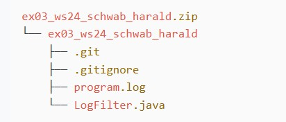

# Exercise 1

## Overview

This is an example Markdown file with additional elements like images, links, and lists.

## Elements

### 1. Image

Here is an image of the project structure:

### 2. Links

- [Google](https://www.google.com)
- [GitHub](https://github.com)
- [Make a README](https://www.makeareadme.com/)

### 3. Lists

#### Unordered List

- Apple
- Banana
- Pear

#### Ordered List

1. Cats
2. Dogs
3. Rabbits

## Internal Link

Go back to the [README](./README.md).

