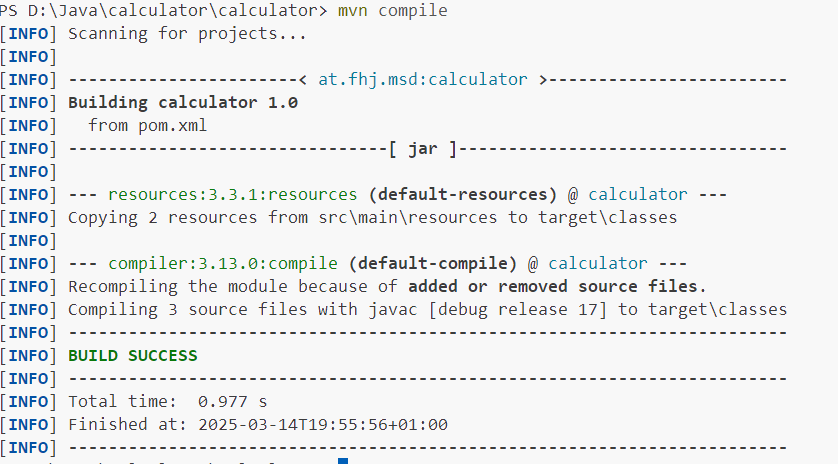
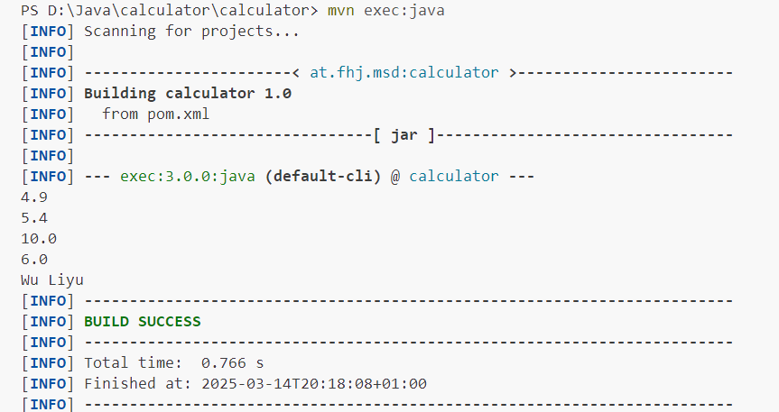
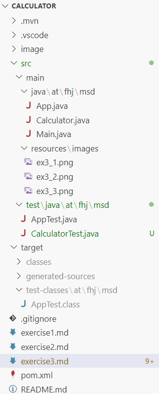

# Exercise 3

## Overview

Here is a brief step-by-step guide to complete Exercise 3.

## Steps

### 1. Set Up Environment

* Install Java JDK – Ensure Java (preferably OpenJDK LTS) is installed and properly configured (JAVA_HOME and PATH variables).
* Install Maven – Download and install Maven, then verify the installation with mvn -v.

### 2. Create a New Maven Project

I use Visual Studio Code to create a new Maven Project. 
* Update the maven archetype catalog to 1.5(when necessary)--> Create Java Project--> Maven--> maven-archetype-quickstart-->at.fhj.msd as group Id --> Calculator as artifact Id --> select the base folder in which the project is to be created --> confirm one or two options --> a new maven project is setup successfully.

Here is the link for the [guildline](https://git-iit.fh-joanneum.at/iit-prog/java2/exercises/-/tree/main/00_maven?ref_type=heads)

### 3. Git Initialize, Set Up und Pull existing changes
>git init  
git remote add origin https://github.com/LiyuWu1976/msd24_wu_liyu.git
git pull origin main
>

### 4. Implement the Java Calculator Class, git add, git commit

### 5. Implement the Java Main Class, git add, git commit

### 6. Configure and Build the Project with Maven
* Screenshot for maven compile: 

### 7. Run the Project
* Screenshot for maven exec:

### 8. Document and Submit the Work

* Command for project-structure: 
> bash
> tree /F > project-structure.txt

* Screenshot for project-structure: 

## Internal Link
Go back to the [README](./README.md).

