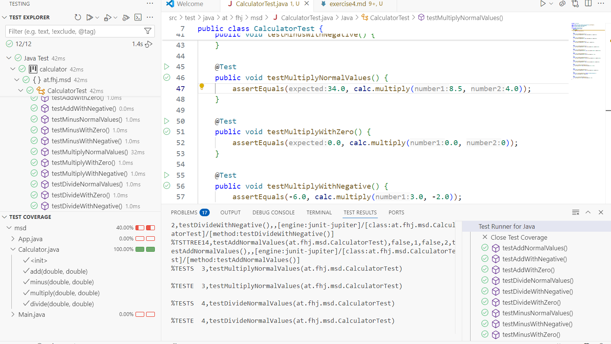
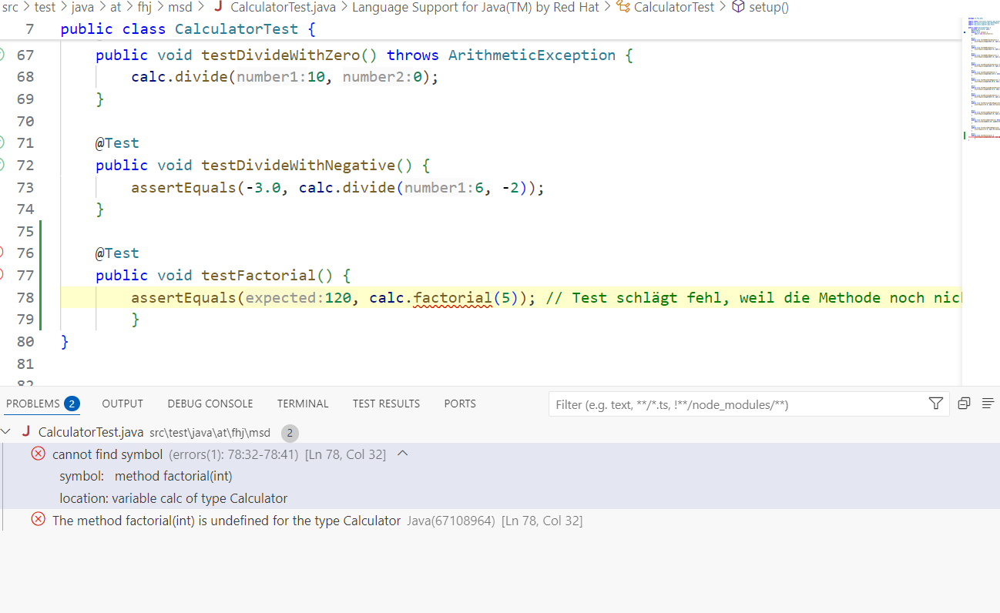
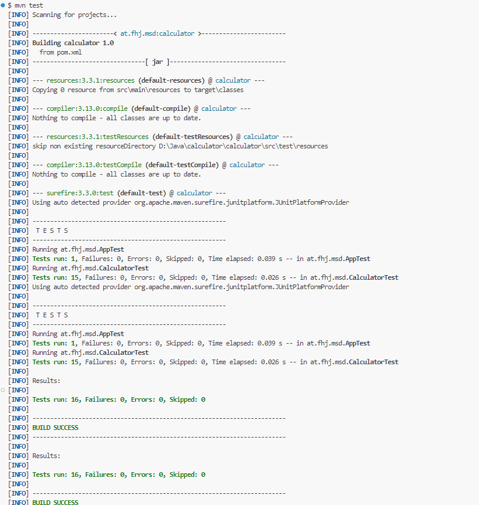

# Exercise 4

## Overview

Here describes which test cases are specifically used in Exercise 4.

## Test cases
|  Methode |       Eingabe      |       Erwartetes Ergebnis    |      Testname      |
|:---------|:-------------------|:-----------------------------|:-------------------|
|  add()  |       2, 3      |       5  |      testAddNormalValues()      |
|  add()  |       0, 0     |       0  |      testAddWithZero()      |
|  add()  |       -2, 3      |       1  |      testAddWithNegative()      |
|  Minus()  |       8, 3      |       5  |      testMinusNormalValues()      |
|  Minus()  |       128, 0      |       128  |      testMinusWithZero()      |
|  Minus()  |       8, -2      |       10  |      testMinusWithNegative()      |
|  Multiply()  |       8.5, 4      |       34  |      testMultiplyNormalValues()      |
|  Multiply()  |       0, 2      |       0  |      testMultiplyWithZero()      |
|  Multiply()  |       3, -2      |       -6  |      testMultiplyWithNegative()      |
|  Divide()  |       10, 2      |       5  |      testDivideNormalValues()      |
|  Divide()  |       10, 0      |       Exception  |      testDividebyZero()      |
|  Divide()  |       6, -2     |       -3  |      testDivideWithNegative()      |

## Screenshots

### 1. run Tests with Coverage

### 2. run Tests without correct implementation of the factorial method

### 3. run Tests after correct implementation of the factorial method

## Internal Link
Go back to the [README](./README.md).

